# Architecture Documentation - CFA Convenios Microservice

## System Overview

The CFA Convenios Microservice is a Spring Boot application that manages partnership agreements, customer contacts, and WhatsApp messaging for CFA (Cooperativa de Farmacéuticos Argentinos).

---

## High-Level Architecture

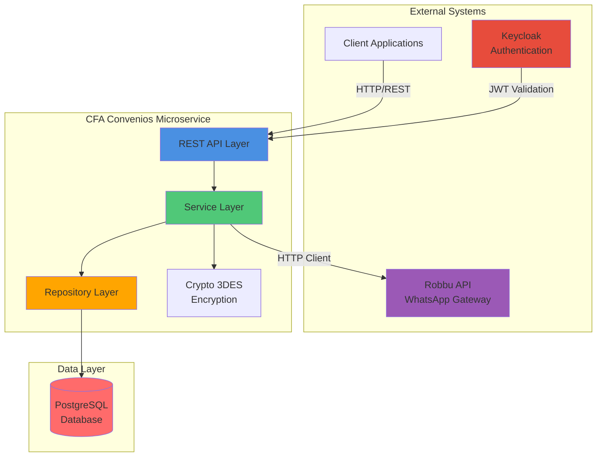

---

## Component Architecture

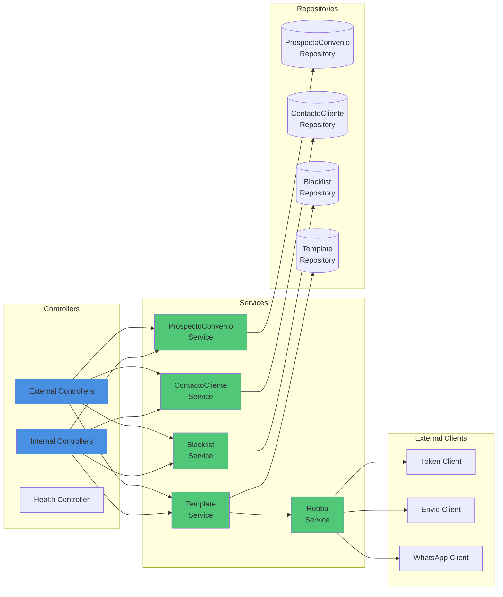

---

## Data Flow - WhatsApp Message Sending

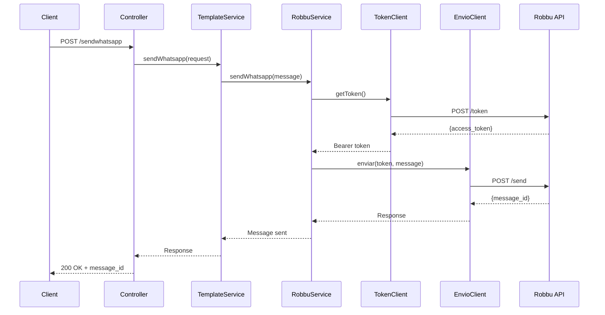

---

## Database Schema

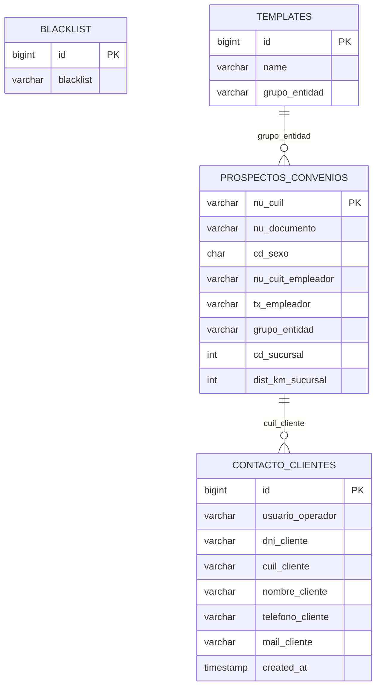

---

## Authentication Flow

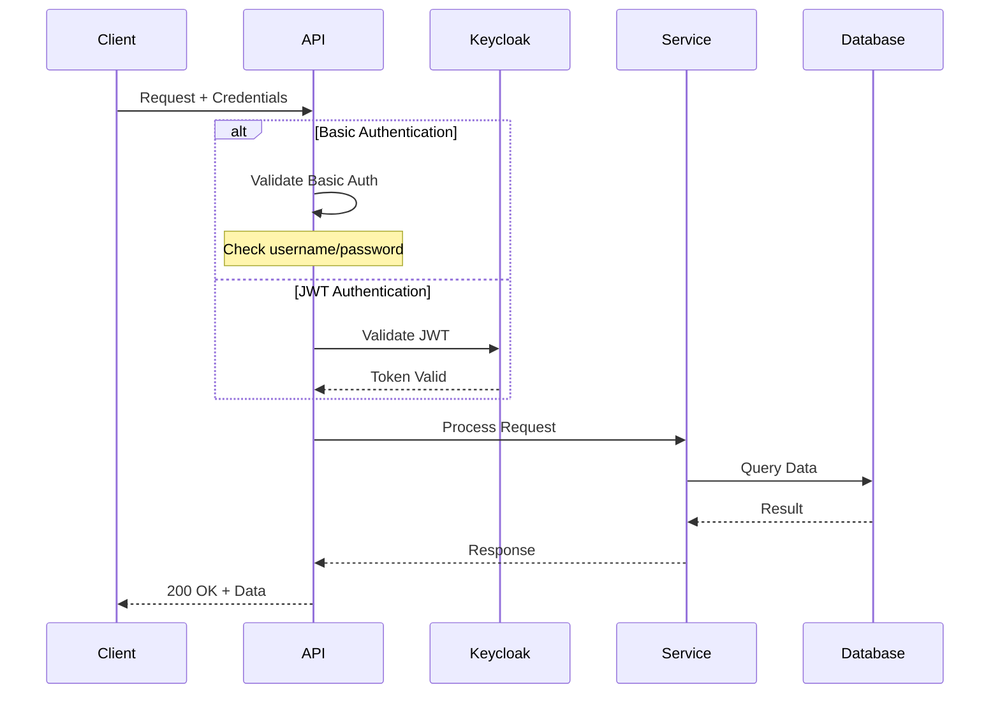

---

## Deployment Architecture

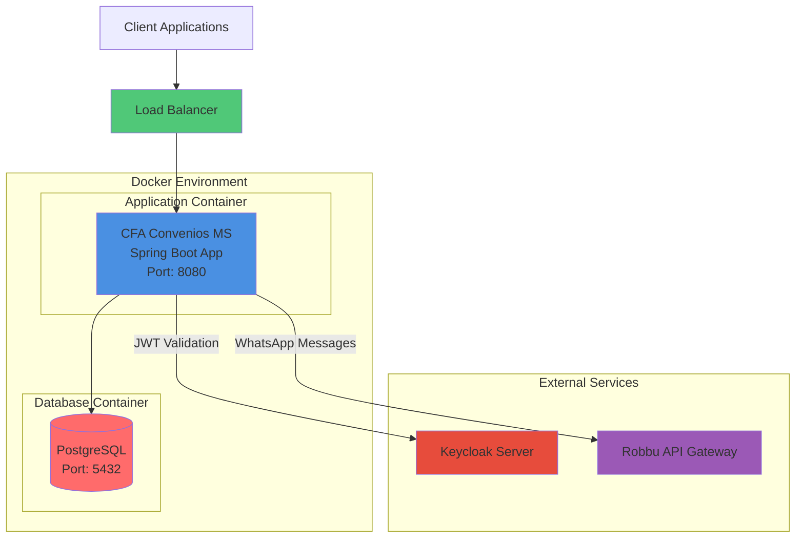

---

## Technology Stack

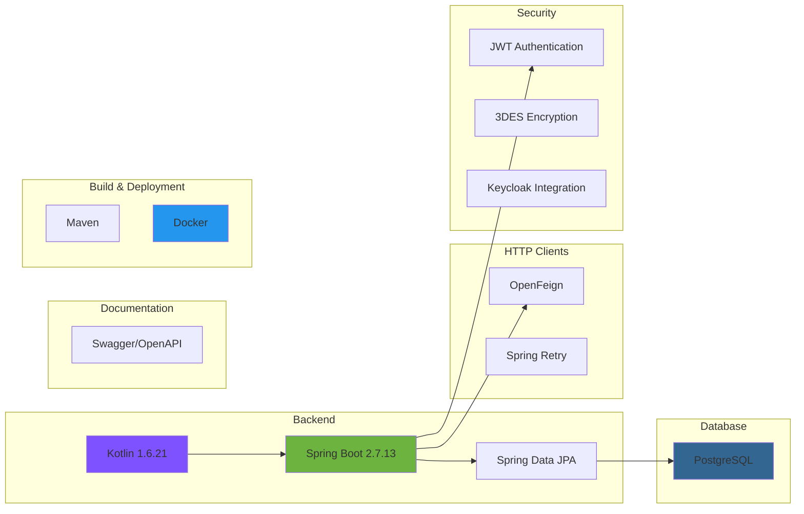

---

## Request/Response Flow

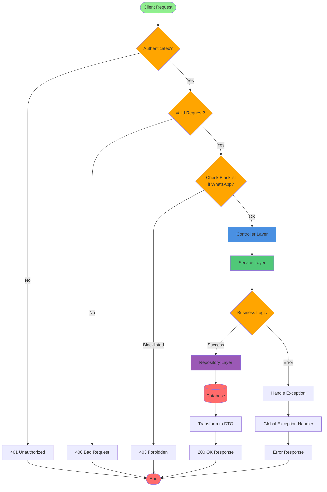

---

## Error Handling Flow

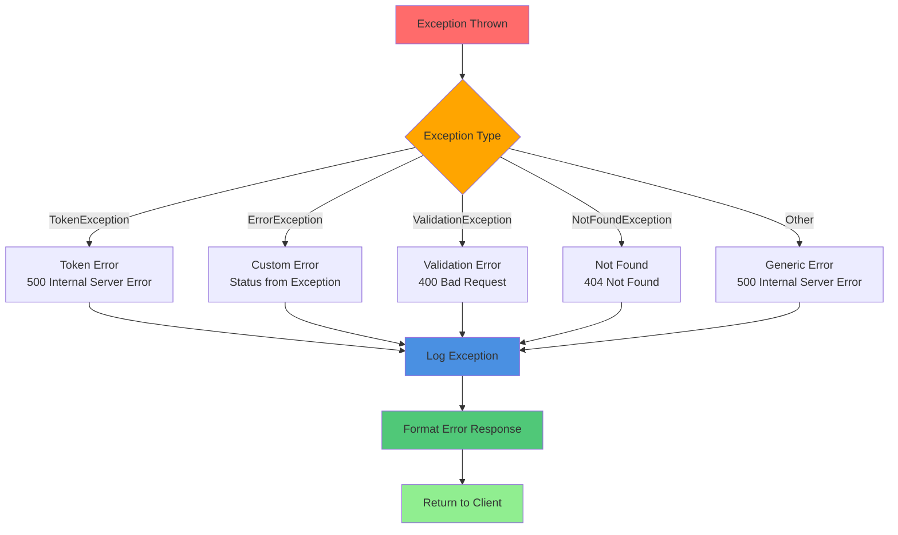

---

## Service Integration Points

### Robbu Integration (WhatsApp)

The microservice integrates with Robbu API for WhatsApp messaging:

1. **Authentication**: Token-based authentication via `/token` endpoint
2. **Message Sending**: POST to `/send` endpoint with message payload
3. **Retry Logic**: Automatic retry on failures using Spring Retry
4. **Error Handling**: Comprehensive error handling for network and API failures

**Robbu Endpoints**:
- Token: `https://api-accounts.robbu.global/token`
- Message: `https://api.robbu.global/send`

### Keycloak Integration (Authentication)

JWT-based authentication with Keycloak:

1. **Token Validation**: Validates JWT tokens using public key
2. **User Authorization**: Extracts user roles and permissions
3. **Realm Configuration**: Supports multiple Keycloak realms

---

## Scalability Considerations

### Horizontal Scaling

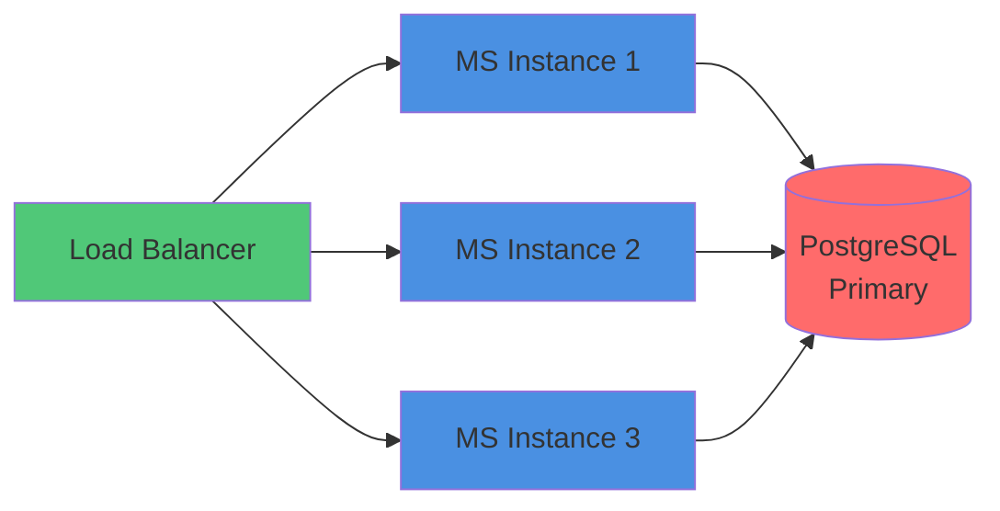

The microservice is designed for horizontal scaling:
- **Stateless Design**: No session state stored in memory
- **Database Connection Pooling**: Efficient database connections
- **Load Balancing**: Multiple instances behind load balancer
- **Graceful Shutdown**: Proper connection cleanup on shutdown

---

## Security Architecture

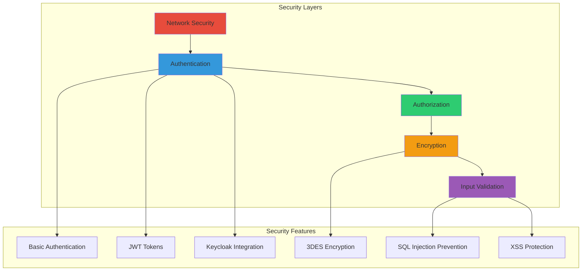

---

## Monitoring and Observability

### Key Metrics to Monitor

1. **Application Metrics**
    - Request rate
    - Response times
    - Error rates
    - Active connections

2. **Database Metrics**
    - Query performance
    - Connection pool utilization
    - Transaction rates

3. **External Integration Metrics**
    - Robbu API response times
    - Robbu API success rates
    - Keycloak validation times

4. **Resource Metrics**
    - CPU usage
    - Memory consumption
    - Thread pool utilization
    - Garbage collection metrics

---

## Data Retention and Archival

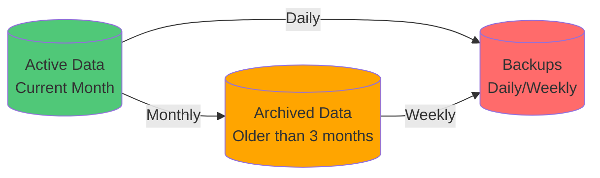

**Recommended Retention Policies**:
- **Active Data**: Current month (in main database)
- **Archived Data**: 2 years (in archive storage)
- **Backups**: 90 days (daily), 1 year (weekly)

---

## Future Enhancements

1. **Caching Layer**: Redis for frequently accessed data
2. **Message Queue**: RabbitMQ/Kafka for async messaging
3. **API Gateway**: Centralized API management
4. **Service Mesh**: Enhanced service-to-service communication
5. **Observability**: Distributed tracing with Jaeger/Zipkin

---

## References

- [Spring Boot Documentation](https://spring.io/projects/spring-boot)
- [Spring Data JPA](https://spring.io/projects/spring-data-jpa)
- [OpenFeign](https://spring.io/projects/spring-cloud-openfeign)
- [Keycloak](https://www.keycloak.org/)
- [PostgreSQL](https://www.postgresql.org/)

---

This architecture is designed to be:
- **Scalable**: Horizontal scaling support
- **Maintainable**: Clear separation of concerns
- **Secure**: Multiple security layers
- **Observable**: Comprehensive logging and monitoring
- **Resilient**: Graceful error handling and retry logic